# Splitwise Clone
Splitwise is a full-stack web application built using the MEAN stack (MongoDB, Express.js, Angular, Node.js). This application allows users to manage group expenses efficiently, providing a platform for splitting bills, tracking balances, and settling debts among friends or group members. It features user-friendly interfaces for managing expenses, creating groups, adding members, and viewing detailed breakdowns of expenses.

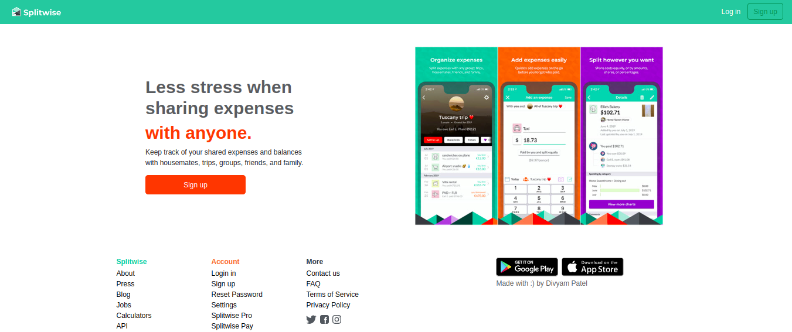
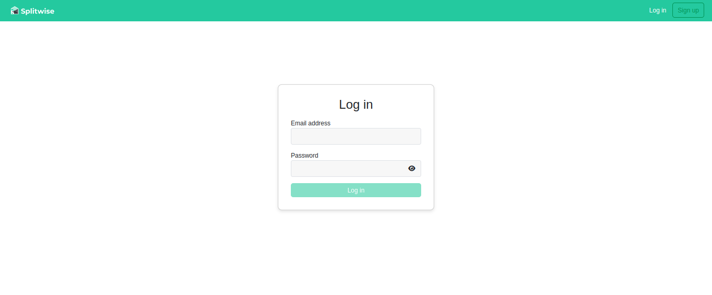
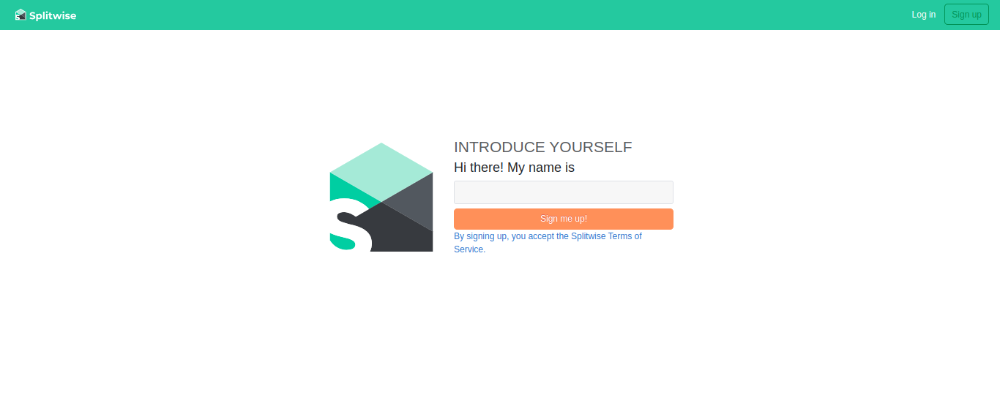
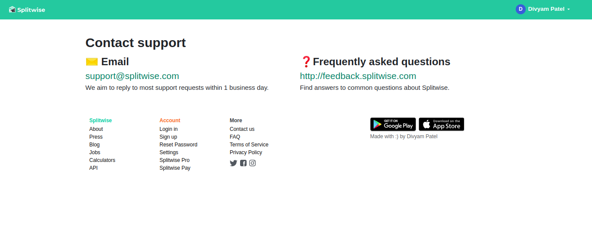
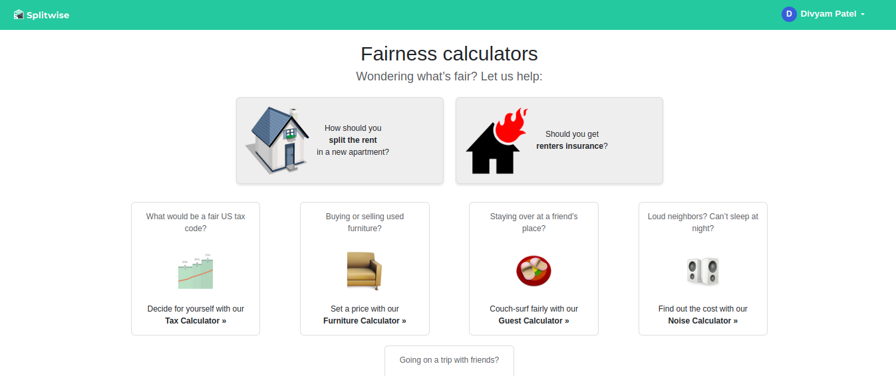
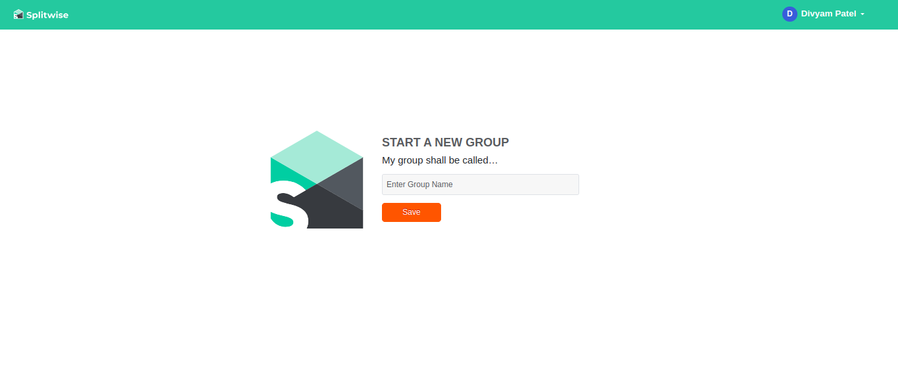
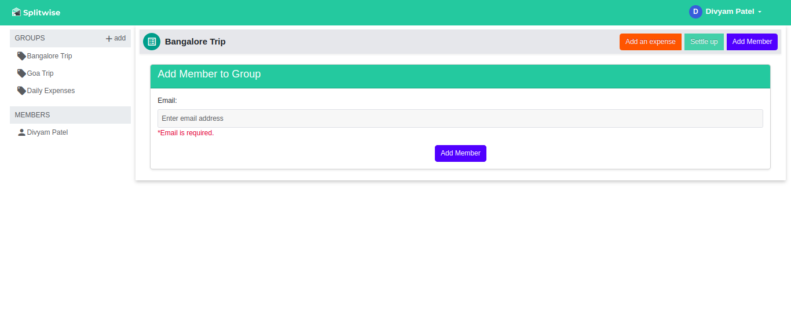
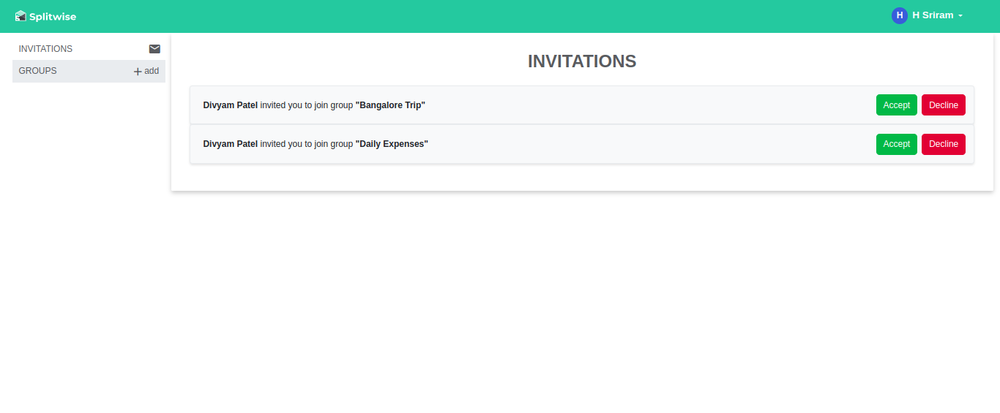
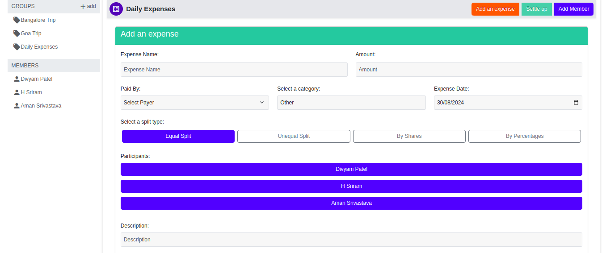
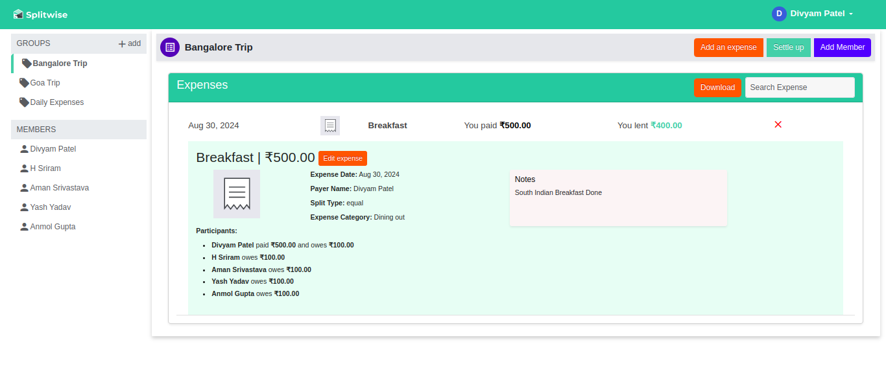
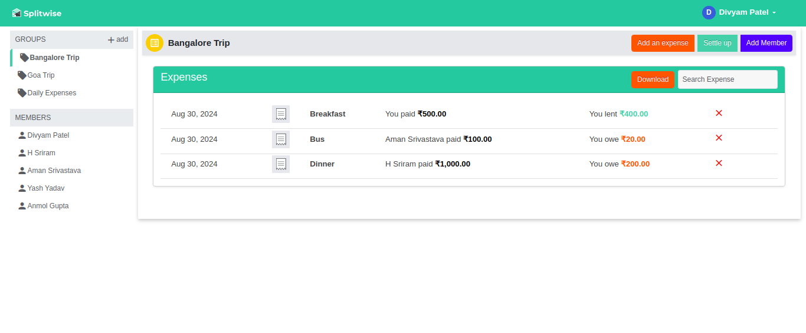
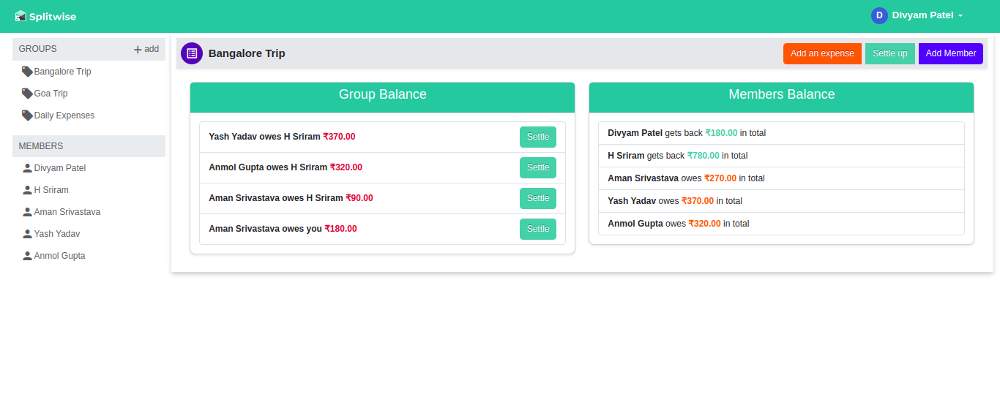

## Features
- **User Authentication**: Secure login and signup process.
- **Group Management**: Create groups, invite members, and manage group settings.
- **Expense Management**: Add, edit, and delete expenses within groups.
- **Balance Tracking**: View detailed balances for each group and member.
- **Expense Splitting**: Simplify dividing expenses with participant-based splitting, unequal splitting, splitting by shares, and percentages.
- **Settling Debts**: Settle up with group members to clear balances.
- **Error Handling**: Comprehensive error handling across all modules.
- **Download Spreadsheets & Charts**: Download expenses as spreadsheets and visualize them with graphs and charts.

## Getting Started

### Prerequisites
- Node.js
- npm (Node Package Manager)
- MongoDB

### Installation
1. **Clone the repository:**
    ```sh
    git clone https://github.com/pateldivyam26/Splitwise.git
    cd Splitwise
    ```

2. **Install dependencies for the server:**
    ```sh
    cd Splitwise_Server
    npm install
    ```

3. **Add .env file for the server:**
    ```sh
    ACCESS_TOKEN_SECRET='ADD_ANY_STRING_HERE'
    MONGODB_URI='ADD_YOUR_MONGODB_CLUSTER_URI_HERE'
    ```
    
4. **Install dependencies for the client:**
    ```sh
    cd ../Splitwise_Client
    npm install
    ```

### Running the Application
1. **Start MongoDB server:**
    Ensure that your MongoDB server is running.

2. **Start the server:**
    ```sh
    cd ../Splitwise_Server
    node server.js
    ```

3. **Start the client:**
    ```sh
    cd ../Splitwise_Client
    ng serve
    ```

4. **Access the application:**
    Open your web browser and navigate to `http://localhost:4200`.

## DB Schema
- **Users**: Stores user information, including groups they belong to and invitations they have received.
- **Groups**: Represents groups, their members, expenses, and balances between members.
- **Invitations**: Manages invitations sent by users to invite others to groups.
- **Expenses**: Tracks expenses, including the payer, participants, and how the expense is split.

## Future Improvements
- **Notifications**: Implement real-time notifications for group activities.
- **Logs**: Introduce activity logs to monitor all changes within the group.
- **Currency Support**: Allow Multi-currency support for international users and automatic currency conversion for expenses
